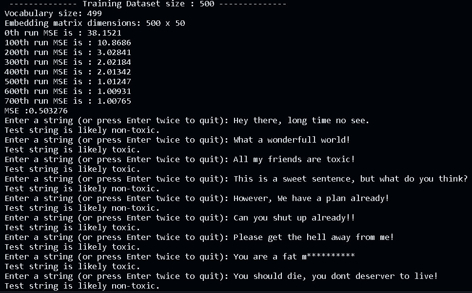

# Toxic-Comments-Classifier-cpp

CodeSpace and Github was not allowing to upload files greater than 25MB, hence uploaded a .7z file less than 25MB and extracted the content via codespace terminal.

`sudo apt-get update`  
`sudo apt-get install p7zip-full`

`7z x train.7z -odata/`  
`7z x test.7z -odata/`

Once you have the .csv files, we will need to do some data process! 
I have used the `DataPreProcessor.py` file, since the comments have a lot of new line and processing it via C++ was bit overwhelming!

Just run the py code and it will generate the new files that containts only the necessary files. 
I have futher cleared all the data an took only 300 record comments only each type is dsitributed equally.

## Steps involved in prepardng data

### tokenizeData :
This function takes a vector of strings and tokenizes each string using the boost::tokenizer with an escaped_list_separator. The result is a vector of vectors of strings, where each inner vector represents the tokens of a corresponding input string.

### createVocabulary :
This function takes tokenized data and creates a vocabulary by inserting unique words from the tokenized data into a set. It ensures that the vocabulary size does not exceed a maximum specified size.

### padData function :
This function pads each sequence in the numeric datawith a specified padding token index to achieve a uniform sequence length (`maxSequenceLength`).

### createWordIdx function :
Creates a word-to-index mapping by iterating through the provided vocabulary and assigning an index to each word. The indices start from 1 and are incremented for each unique word (Index 0 is used by padding token).

### tokenizeAndNumberizeData function :
This function takes tokenized data and converts it into a numeric representation by replacing each token with its corresponding index from the wordToIndex mapping.

### createEmbeddingMatrix function :
This function creates a random embedding matrix of size vocabSize by embeddingDimension. It initializes the matrix with random values sampled from a uniform distribution between -0.5 and 0.5, providing a consistent initialization for the embeddings.

The data is processed and now its ready to be feed to the Neural Network.

## Training Model

I have implemented a simple Multi-Layer Perceptron in my previous project [Link here](https://github.com/Shreyas9699/Neural-Network-CPP/tree/main).
I have used the same code to create a MLP and then train the model with the above data.

### Output:
##### Commad: `g++ -g main.cpp header/csvReader.cpp header/MLPerceptrons.cpp header/Tokenizer.cpp header/dataPreProcessor.cpp -o main`
Once training it done. You can enter test string where you can input strings to get and model will predict wether the string is toxic or non toxic. 

### Updates:
> `10=OCT-2024` Added custom Tokenizer code, no need for Boost Lib anymore.

#### Remark:
- Since this is a huge dataset and running it all in C++ causing memory leaks. And Since I still do not have enough experties in memory managment I have reduced the size to managable.
- This is not optimized, I have justed wanted to try implement a working classifier in C++, Please feel free to take and optimized it!
- The same dataset is already impleted in python using similar structure in python, [Click here](https://github.com/Shreyas9699/Convolutions-text-classification)

